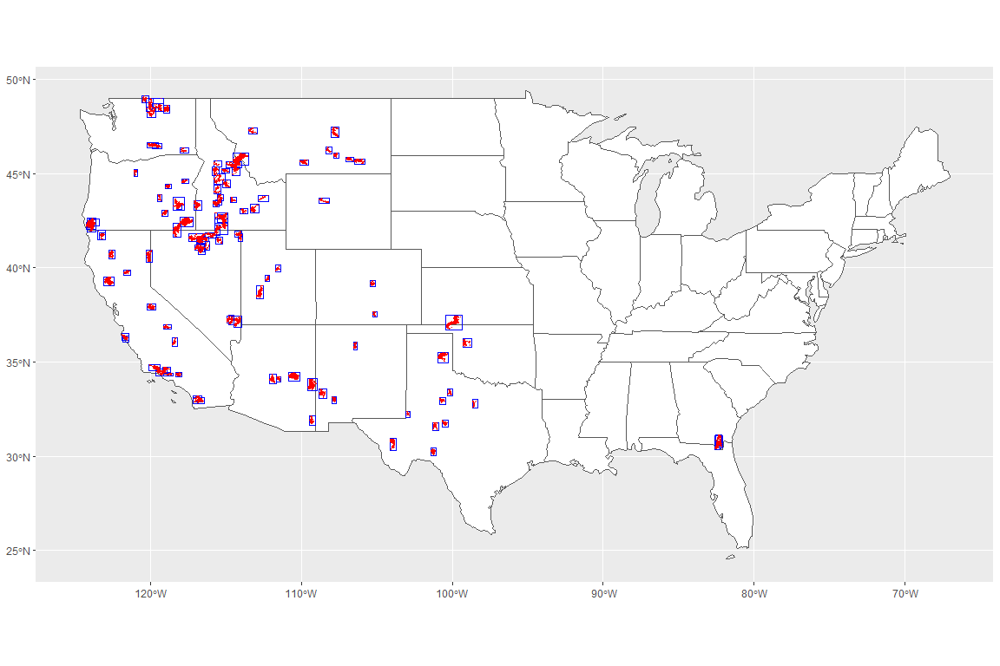

LiDAR and Wildfire Data
================
Last updated by Jordan Wingenroth on
11/01/23

## Goal

We seek to find areas where LiDAR data were collected before and after a
fire. That might allow us some insight into the effects of fire on the
properties of vegetation canopy, underbrush, and other layers. It is
possible we could do so using the machine-learning approach that Tony
proposed.

## Approach

Fire perimeters are sourced from the National Interagency Fire Center’s
[GIS
Explorer](https://data-nifc.opendata.arcgis.com/datasets/nifc::historic-perimeters-combined-2000-2018-geomac/explore?location=39.096733%2C-96.133955%2C5.57).
LiDAR data come from the [web
API](https://apps.nationalmap.gov/tnmaccess/#/) provided by [The
National Map](https://apps.nationalmap.gov/lidar-explorer/#/). I plan to
use the R packages in the [tidyverse](https://www.tidyverse.org) to
process these data, also using [curl](https://curl.se/) to pull data
down from the web and [sf](https://r-spatial.github.io/sf/#cheatsheet)
for spatial analysis. I’ll leave in the package messages and metadata
just in case they help down the road.

The general approach is to create a GIS layer of bounding boxes for
large fires, use those bounding boxes to query the LiDAR API for data,
and then assess the overlap of pre-fire and post-fire LiDAR data.

``` r
knitr::opts_chunk$set(fig.width=12, fig.height=8, fig.align = "center")

# Load R packages
library(tidyverse)
```

    ## ── Attaching core tidyverse packages ──────────────────────── tidyverse 2.0.0 ──
    ## ✔ dplyr     1.1.3     ✔ readr     2.1.4
    ## ✔ forcats   1.0.0     ✔ stringr   1.5.0
    ## ✔ ggplot2   3.4.3     ✔ tibble    3.2.1
    ## ✔ lubridate 1.9.2     ✔ tidyr     1.3.0
    ## ✔ purrr     1.0.2     
    ## ── Conflicts ────────────────────────────────────────── tidyverse_conflicts() ──
    ## ✖ dplyr::filter() masks stats::filter()
    ## ✖ dplyr::lag()    masks stats::lag()
    ## ℹ Use the conflicted package (<http://conflicted.r-lib.org/>) to force all conflicts to become errors

``` r
library(curl)
```

    ## Using libcurl 7.84.0 with Schannel
    ## 
    ## Attaching package: 'curl'
    ## 
    ## The following object is masked from 'package:readr':
    ## 
    ##     parse_date

``` r
library(sf)
```

    ## Linking to GEOS 3.11.2, GDAL 3.6.2, PROJ 9.2.0; sf_use_s2() is TRUE

``` r
library(spData) # Background maps
```

    ## The legacy packages maptools, rgdal, and rgeos, underpinning the sp package,
    ## which was just loaded, will retire in October 2023.
    ## Please refer to R-spatial evolution reports for details, especially
    ## https://r-spatial.org/r/2023/05/15/evolution4.html.
    ## It may be desirable to make the sf package available;
    ## package maintainers should consider adding sf to Suggests:.
    ## The sp package is now running under evolution status 2
    ##      (status 2 uses the sf package in place of rgdal)
    ## To access larger datasets in this package, install the spDataLarge
    ## package with: `install.packages('spDataLarge',
    ## repos='https://nowosad.github.io/drat/', type='source')`

``` r
sf_use_s2(FALSE) # Turn off spherical geometry
```

    ## Spherical geometry (s2) switched off

## Fire data

``` r
# Read fire data, which is local for now but could be uploaded to a cloud server if we want full reproducibility
fires <- st_read("./data/Historic_Perimeters_Combined_2000-2018_GeoMAC/US_HIST_FIRE_PERIMTRS_2000_2018_DD83.shp")
```

    ## Reading layer `US_HIST_FIRE_PERIMTRS_2000_2018_DD83' from data source 
    ##   `C:\Users\jwing\main\RFF\Wildfire\data\Historic_Perimeters_Combined_2000-2018_GeoMAC\US_HIST_FIRE_PERIMTRS_2000_2018_DD83.shp' 
    ##   using driver `ESRI Shapefile'
    ## Simple feature collection with 23776 features and 23 fields
    ## Geometry type: MULTIPOLYGON
    ## Dimension:     XY
    ## Bounding box:  xmin: -178.8415 ymin: 3.386425 xmax: -65.33316 ymax: 70.15916
    ## Geodetic CRS:  WGS 84

``` r
# Get bounding boxes for the largest fires in the dataset
bboxes <- fires %>%
    filter(gisacres > 1e5) %>%
    group_by(uniquefire, incidentna) %>%
    filter(gisacres == max(gisacres)) %>%
    transmute(bbox = st_as_sfc(st_bbox(geometry))) %>%
    st_crop(c(xmin = -140, xmax = -60, ymin = 0, ymax = 50)) # Drop Alaska fires for now
```

    ## although coordinates are longitude/latitude, st_intersection assumes that they
    ## are planar

    ## Warning: attribute variables are assumed to be spatially constant throughout
    ## all geometries

``` r
# Plot those fires and those bounding boxes
bboxes$bbox %>%
    ggplot() +
    geom_sf(data = spData::us_states, fill = "white") + # Background map
    geom_sf(color = "blue", fill = NA) +
    geom_sf(data = bboxes, fill = "red", color = NA)
```



## LiDAR data

The [guide to the TNM
API](https://apps.nationalmap.gov/help/documents/TNMAccessAPIDocumentation/TNMAccessAPIDocumentation.pdf)
says that there are almost 4 million products available. Running the
[products query with no
arguments](https://tnmaccess.nationalmap.gov/api/v1/products) suggests
that that guide is out of date and there are in fact almost 13 million
products available (upper left). Queries targeting LiDAR data
specifically show that there are almost 7 million LiDAR products
available, all but five of which are available in the common LAS or LAZ
(compressed LAS) formats. Granted, most of these are small-ish
rectangles that are components of a given project conducted by USGS or
another agency.

The maximum page size of the LiDAR API appears to be 1,000 records.
Multiple queries with an increasing offset variable can be used to
collect more than 1,000 records for a set of other constraints. For each
of the large fires shown above, I will query LiDAR data that intersects
its bounding box. I’m not sure if polygons that cross the boxes’
boundaries will be included or excluded but LiDAR extents tend to be
small relative to these fire perimeters in my experience.

``` r
# Specify our page size (I found this to be the maximum page size available)
max_n <- 1000

# Create an offset variable to advance from page to page
offset <- 0
offset_url <- paste0("offset=",offset)

# Also specify a break point to avoid a runaway while loop
break_n <- 0 # will increase

# Describe URL components for the query
root_url <- "https://tnmaccess.nationalmap.gov/api/v1/products?"
bbox_url <- "bbox=-100,40,-99,41"
type_url <- "datasets=Lidar%20Point%20Cloud%20(LPC)"
maxn_url <- "max=1000"
form_url <- "outputFormat=CSV"

# Update the query
url <- url(paste0(root_url,bbox_url,"&",type_url,"&",maxn_url,"&",offset_url,"&",form_url))

# Download the data
new_data <- read_csv(url)
```

    ## Rows: 1000 Columns: 25
    ## ── Column specification ────────────────────────────────────────────────────────
    ## Delimiter: ","
    ## chr  (17): title, moreInfo, sourceId, sourceName, sourceOriginName, metaUrl,...
    ## dbl   (2): sizeInBytes, bestFitIndex
    ## lgl   (2): sourceOriginId, downloadURLRaster
    ## dttm  (2): lastUpdated, dateCreated
    ## date  (2): publicationDate, modificationInfo
    ## 
    ## ℹ Use `spec()` to retrieve the full column specification for this data.
    ## ℹ Specify the column types or set `show_col_types = FALSE` to quiet this message.

``` r
# Create a copy to compile data from multiple queries
data_all <- new_data

# Query the server repeatedly until either a partial page of results is returned or the break point is reached
suppressMessages({ # Remove repeated, identical messages
    while (nrow(new_data) == max_n & nrow(data_all) <= break_n) {
        offset <- offset + max_n
        offset_url <- paste0("offset=",offset)
        url <- url(paste0(root_url,bbox_url,"&",type_url,"&",maxn_url_fixed,"&",offset_url,"&",form_url))
        new_data <- read_csv(url)
        data_all <- bind_rows(data_all, new_data)
    }
})
```

To begin moving towards a sensible dataset size, let’s restrict our
search to the continental US (CONUS). Not that it helps all that much,
seeing as there are still over 6 million products. A bounding box for
the CONUS spans roughly 60 degrees of longitude (125° W to 65° W) and 30
degrees of latitude (20° N to 50° N), including a little bit of cushion.

Let’s get our hands dirty. I’m going to pick a random 1°×1° box
somewhere in the Western US and query all the LiDAR data it contains.

``` r
ptm <- proc.time() # A timer will help assess the feasibility of upscaling


# Open a connection to the server using the query
url <- url(paste0(root_url,bbox_url,"&",type_url,"&",maxn_url,"&",form_url))

# Download the data from the server
data <- read_csv(url)
```

    ## Rows: 1000 Columns: 25
    ## ── Column specification ────────────────────────────────────────────────────────
    ## Delimiter: ","
    ## chr  (17): title, moreInfo, sourceId, sourceName, sourceOriginName, metaUrl,...
    ## dbl   (2): sizeInBytes, bestFitIndex
    ## lgl   (2): sourceOriginId, downloadURLRaster
    ## dttm  (2): lastUpdated, dateCreated
    ## date  (2): publicationDate, modificationInfo
    ## 
    ## ℹ Use `spec()` to retrieve the full column specification for this data.
    ## ℹ Specify the column types or set `show_col_types = FALSE` to quiet this message.

``` r
proc.time() - ptm # Calculate duration
```

    ##    user  system elapsed 
    ##    0.05    0.00   13.36

The API guide said that it was possible to get 10,000 results per page,
but it appears that the limit is actually 1,000. Oh well.

``` r
maxn_url_fixed <- "max=1000"

offset <- 100 # Start with the 101st item
offset_url <- paste0("offset=",offset)

# Update the query
url <- url(paste0(root_url,bbox_url,"&",type_url,"&",maxn_url_fixed,"&",offset_url,"&",form_url))

# Download data using the new query
data_check <- read_csv(url)
```

    ## Rows: 1000 Columns: 25
    ## ── Column specification ────────────────────────────────────────────────────────
    ## Delimiter: ","
    ## chr  (17): title, moreInfo, sourceId, sourceName, sourceOriginName, metaUrl,...
    ## dbl   (2): sizeInBytes, bestFitIndex
    ## lgl   (2): sourceOriginId, downloadURLRaster
    ## dttm  (2): lastUpdated, dateCreated
    ## date  (2): publicationDate, modificationInfo
    ## 
    ## ℹ Use `spec()` to retrieve the full column specification for this data.
    ## ℹ Specify the column types or set `show_col_types = FALSE` to quiet this message.

``` r
# Check how many items are shared in common between the two
length(intersect(data$downloadURL, data_check$downloadURL)) # URLs are unique identifiers
```

    ## [1] 900

As we’d expect, skipping 100 entries leaves 900 entries in common. Now
let’s see if we can get all the data from our 1°×1° box into one table.

``` r
# Also specify a break point for our loop for safety
break_n <- 2e4 # i.e., 10,000

# Reset the offset
offset <- 0
offset_url <- paste0("offset=",offset)

ptm <- proc.time() # Start the timer

# Update the query
url <- url(paste0(root_url,bbox_url,"&",type_url,"&",maxn_url_fixed,"&",offset_url,"&",form_url))

# Download the data
new_data <- read_csv(url)
```

    ## Rows: 1000 Columns: 25
    ## ── Column specification ────────────────────────────────────────────────────────
    ## Delimiter: ","
    ## chr  (17): title, moreInfo, sourceId, sourceName, sourceOriginName, metaUrl,...
    ## dbl   (2): sizeInBytes, bestFitIndex
    ## lgl   (2): sourceOriginId, downloadURLRaster
    ## dttm  (2): lastUpdated, dateCreated
    ## date  (2): publicationDate, modificationInfo
    ## 
    ## ℹ Use `spec()` to retrieve the full column specification for this data.
    ## ℹ Specify the column types or set `show_col_types = FALSE` to quiet this message.

``` r
# Create a copy to compile data from multiple queries
data_all <- new_data

# Query the server repeatedly until either a partial page of results is returned or the break point is reached
suppressMessages({ # Remove repeated, identical messages
    while (nrow(new_data) == max_n & nrow(data_all) <= break_n) {
        offset <- offset + max_n
        offset_url <- paste0("offset=",offset)
        url <- url(paste0(root_url,bbox_url,"&",type_url,"&",maxn_url_fixed,"&",offset_url,"&",form_url))
        new_data <- read_csv(url)
        data_all <- bind_rows(data_all, new_data)
    }
})

proc.time() - ptm # This could be inaccurate because repeating a query yields results much faster
```

    ##    user  system elapsed 
    ##    0.86    0.08   39.77

``` r
nrow(data_all) == length(unique(data_all$downloadURL)) # Check whether all results are unique
```

    ## [1] TRUE

``` r
nrow(data_all) # Total number of products in the box
```

    ## [1] 10314

On the first go, getting 10,000 results took about 45 seconds. Round up
to a minute and that suggests we could populate a table with all 7
million results in less than 12 hours if we wanted to, assuming that the
TNM API doesn’t use DDoS-prevention technology.

## Assessing overlap of LiDAR data

Let’s see how often the data in our little box overlap. If overlap is
limited, maybe we’ll need to zoom out to a bigger box.

``` r
# Extract minimum and maximum latitude and longitude from the boundingBox variable
bboxes <- data_all %>%
    select(downloadURL, publicationDate, box = boundingBox) %>% # Collection date does not appear to be available
    separate(box, sep = "min|max", into = c(NA, "xmin", "xmax", "ymin", "ymax")) %>% # Split bounding-box column
    mutate(across(xmin:ymax, ~str_extract(.x, "-?[0-9]+.[0-9]+"))) %>% # Extract numbers
    mutate(across(xmin:ymax, as.numeric)) # Convert to numeric type

# Assess total area covered by LiDAR data
bboxes %>%
    mutate(area = (xmax - xmin)*(ymax - ymin)) %>%
    summarise(sum(area))
```

    ## # A tibble: 1 × 1
    ##   `sum(area)`
    ##         <dbl>
    ## 1        2.08

That is promising. Our random box has an area of 1° squared, but
contains about 2° squared worth of LiDAR data. Granted, these are
bounding boxes so coverage is not guaranteed, but most LiDAR products
from The National Map are rectangular, at least in my experience.

``` r
# Convert the bounding boxes to a spatial object
bbox_layer <- bboxes %>%
    pivot_longer(c(xmin, xmax), names_to = "x", values_to = "lon") %>% # This and the next command
    pivot_longer(c(ymin, ymax), names_to = "y", values_to = "lat") %>% # create rows for each corner
    group_by(downloadURL, publicationDate) %>%
    # Create convex polygons (rectangles) from each set of four corners
    summarise(geometry = st_convex_hull(st_sfc(st_cast(st_multipoint(cbind(lon, lat)), 'POLYGON')))) %>% 
    st_sf() # Convert the tibble to a simple feature collection (sf type)
```

    ## `summarise()` has grouped output by 'downloadURL'. You can override using the
    ## `.groups` argument.

``` r
# Plot the data
bbox_layer %>%
    ggplot(aes(fill = publicationDate)) + # Fill polygons according to publication date
    geom_sf(color = NA, show.legend = FALSE) +
    scale_fill_viridis_c(trans = "date", option = "turbo") + # Change color scale
    facet_wrap(~publicationDate) +
    theme(axis.text.x = element_text(angle = 45, hjust = 1))
```


There are in fact data products published on seven different dates! The
three publications in 2019 and 2020 are clearly all from the same
dataset based on the shapes. But still, most of the box is covered at
two timepoints, about five years apart. We’ll see how common this is
going forward.

## Next steps

- Focus on areas covered by fire perimeters
- Scale up
- Find cases where LiDAR publication dates sandwich fire perimeter dates
