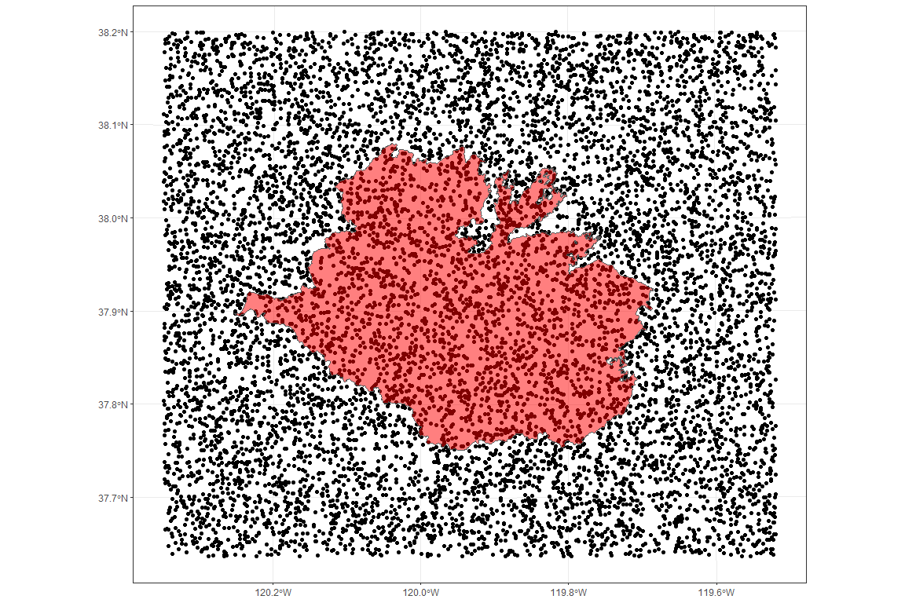

Mapping source year for spotted owl predicted habitat
================
Last updated by Jordan Wingenroth on
11/06/23

## Environment info

Code excluded here for brevity.

    ## ── Attaching core tidyverse packages ──────────────────────── tidyverse 2.0.0 ──
    ## ✔ dplyr     1.1.3     ✔ readr     2.1.4
    ## ✔ forcats   1.0.0     ✔ stringr   1.5.0
    ## ✔ ggplot2   3.4.3     ✔ tibble    3.2.1
    ## ✔ lubridate 1.9.2     ✔ tidyr     1.3.0
    ## ✔ purrr     1.0.2     
    ## ── Conflicts ────────────────────────────────────────── tidyverse_conflicts() ──
    ## ✖ dplyr::filter() masks stats::filter()
    ## ✖ dplyr::lag()    masks stats::lag()
    ## ℹ Use the conflicted package (<http://conflicted.r-lib.org/>) to force all conflicts to become errors
    ## Using libcurl 7.84.0 with Schannel
    ## 
    ## 
    ## Attaching package: 'curl'
    ## 
    ## 
    ## The following object is masked from 'package:readr':
    ## 
    ##     parse_date
    ## 
    ## 
    ## Linking to GEOS 3.11.2, GDAL 3.6.2, PROJ 9.2.0; sf_use_s2() is TRUE
    ## 
    ## The legacy packages maptools, rgdal, and rgeos, underpinning the sp package,
    ## which was just loaded, will retire in October 2023.
    ## Please refer to R-spatial evolution reports for details, especially
    ## https://r-spatial.org/r/2023/05/15/evolution4.html.
    ## It may be desirable to make the sf package available;
    ## package maintainers should consider adding sf to Suggests:.
    ## The sp package is now running under evolution status 2
    ##      (status 2 uses the sf package in place of rgdal)
    ## 
    ## To access larger datasets in this package, install the spDataLarge
    ## package with: `install.packages('spDataLarge',
    ## repos='https://nowosad.github.io/drat/', type='source')`

    ## Warning: package 'stars' was built under R version 4.3.2

    ## Loading required package: abind
    ## Spherical geometry (s2) switched off

## When were the data informing spotted owl habitat preference collected?

Our goal was to make sure that the dataset we use to predict spotted owl
habitat preference is not informed by landscape changes caused by the
Rim Fire.

Data were sourced [here](https://map.dfg.ca.gov/metadata/ds2185.html).

Some legwork was required because of the formatting of the data. I was
unable to access the geospatial data in R initially, and when I tried
GIS, I was unable to use the other variables. I converted the raster to
a vector file in GIS, dropping the other attributes, and now I’ll join
them back up in R. I clipped to the area around the Rim Fire for the
conversion because converting the whole state of California took too
long. Ultimately, all that was needed in R was a test for the latest
year in this subset.

``` r
owl_vat <- st_read("./data/owl_raster/ds2185.gdb", layer = "VAT_ds2185") %>%
    tibble()
```

    ## Reading layer `VAT_ds2185' from data source 
    ##   `C:\Users\jwing\main\RFF\Wildfire\data\owl_raster\ds2185.gdb' 
    ##   using driver `OpenFileGDB'

    ## Warning: no simple feature geometries present: returning a data.frame or tbl_df

``` r
owl_shp <- st_read("./data/owl_raster/owl_raster_key.shp")
```

    ## Reading layer `owl_raster_key' from data source 
    ##   `C:\Users\jwing\main\RFF\Wildfire\data\owl_raster\owl_raster_key.shp' 
    ##   using driver `ESRI Shapefile'
    ## Simple feature collection with 5082192 features and 1 field
    ## Geometry type: POINT
    ## Dimension:     XY
    ## Bounding box:  xmin: -30645 ymin: -42165 xmax: 42345 ymax: 20445
    ## Projected CRS: NAD83 / California Albers

``` r
owl_vat %>%
    filter(Value %in% owl_shp$VALUE) %>%
    mutate(year = as.numeric(SOURCE_YEAR)) %>%
    summarise(max(year))
```

    ## # A tibble: 1 × 1
    ##   `max(year)`
    ##         <dbl>
    ## 1        2009

A value of less than 2013 indicates that we don’t need to worry about
the Rim Fire affecting our spotted owl habitat preference data.

I’ll verify that the subset of the owl data covers the vicinity of the
Rim Fire. Doing anything with the super-high-resolution `owl_shp` point
data takes forever so I am going to subsample it randomly to get a
general idea of its spatial range.

``` r
fires <- st_read("./data/CA_fire_perimeters/California_Fire_Perimeters__all_.shp")
```

    ## Reading layer `California_Fire_Perimeters__all_' from data source 
    ##   `C:\Users\jwing\main\RFF\Wildfire\data\CA_fire_perimeters\California_Fire_Perimeters__all_.shp' 
    ##   using driver `ESRI Shapefile'
    ## Simple feature collection with 21926 features and 21 fields
    ## Geometry type: MULTIPOLYGON
    ## Dimension:     XY
    ## Bounding box:  xmin: -13848330 ymin: 3833204 xmax: -12705610 ymax: 5255380
    ## Projected CRS: WGS 84 / Pseudo-Mercator

``` r
rim <- fires %>%
    filter(FIRE_NAME == "RIM", YEAR_ == 2013)

owl_shp[sample(1:nrow(owl_shp), 1e4),] %>%
    ggplot() +
    geom_sf() +
    geom_sf(data = rim, fill = "red", alpha = .5) +
    theme_bw()
```



Tony asked for the owl habitat quality data, and I suggested a raster
format to help with compression. It’s important to note the coordinate
reference system from the original shapefile: “NAD83 / California
Albers”. I don’t believe this information will be included in the raster
(.tif) file.

``` r
owl_big <- left_join(owl_shp, owl_vat, by = c("VALUE" = "Value"))

owl_tidy <- owl_big %>%
    filter(NAME == "SPOTTED OWL") %>%
    select(quality = MEAN, geometry)

owl_raster <- st_rasterize(owl_tidy)

write_stars(owl_raster, "output/owl_habitat_quality_near_Rim.tif")
```
