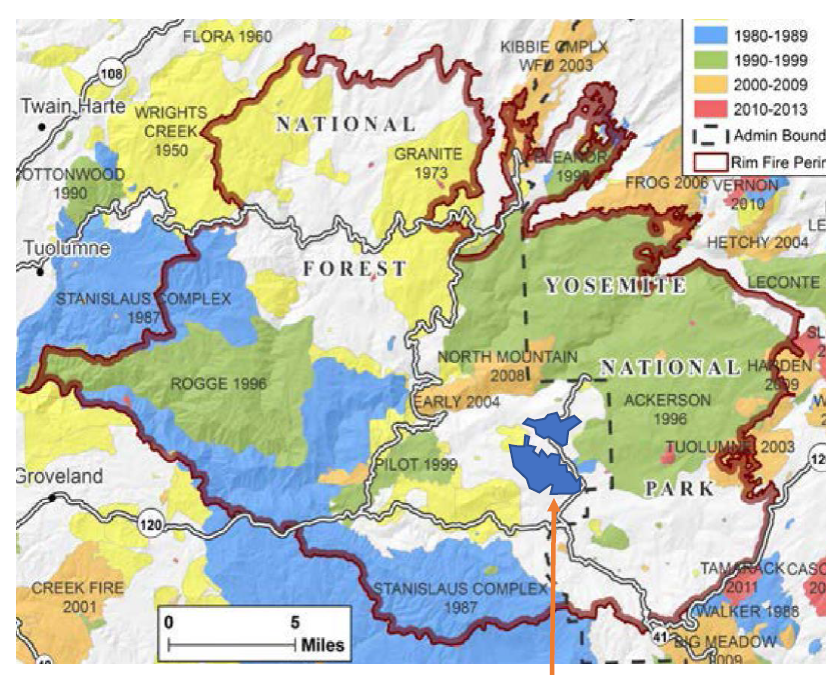

Fires overlapping the Rim Fire perimeter
================
Last updated by Jordan Wingenroth on
11/01/23

## Environment info

``` r
knitr::opts_chunk$set(fig.width=12, fig.height=8, fig.align = "center")

# Load R packages
library(tidyverse)
```

    ## ── Attaching core tidyverse packages ──────────────────────── tidyverse 2.0.0 ──
    ## ✔ dplyr     1.1.3     ✔ readr     2.1.4
    ## ✔ forcats   1.0.0     ✔ stringr   1.5.0
    ## ✔ ggplot2   3.4.3     ✔ tibble    3.2.1
    ## ✔ lubridate 1.9.2     ✔ tidyr     1.3.0
    ## ✔ purrr     1.0.2     
    ## ── Conflicts ────────────────────────────────────────── tidyverse_conflicts() ──
    ## ✖ dplyr::filter() masks stats::filter()
    ## ✖ dplyr::lag()    masks stats::lag()
    ## ℹ Use the conflicted package (<http://conflicted.r-lib.org/>) to force all conflicts to become errors

``` r
library(curl)
```

    ## Using libcurl 7.84.0 with Schannel
    ## 
    ## Attaching package: 'curl'
    ## 
    ## The following object is masked from 'package:readr':
    ## 
    ##     parse_date

``` r
library(sf)
```

    ## Linking to GEOS 3.11.2, GDAL 3.6.2, PROJ 9.2.0; sf_use_s2() is TRUE

``` r
library(spData) # Background maps
```

    ## The legacy packages maptools, rgdal, and rgeos, underpinning the sp package,
    ## which was just loaded, will retire in October 2023.
    ## Please refer to R-spatial evolution reports for details, especially
    ## https://r-spatial.org/r/2023/05/15/evolution4.html.
    ## It may be desirable to make the sf package available;
    ## package maintainers should consider adding sf to Suggests:.
    ## The sp package is now running under evolution status 2
    ##      (status 2 uses the sf package in place of rgdal)
    ## To access larger datasets in this package, install the spDataLarge
    ## package with: `install.packages('spDataLarge',
    ## repos='https://nowosad.github.io/drat/', type='source')`

``` r
sf_use_s2(FALSE) # Turn off spherical geometry
```

    ## Spherical geometry (s2) switched off

## Fire data

Data were sourced from Cal Fire via this [web
page](https://gis.data.ca.gov/maps/e3802d2abf8741a187e73a9db49d68fe/about).

First, a plot of the Rim Fire perimeter:

``` r
fires <- st_read("./data/CA_fire_perimeters/California_Fire_Perimeters__all_.shp")
```

    ## Reading layer `California_Fire_Perimeters__all_' from data source 
    ##   `C:\Users\jwing\main\RFF\Wildfire\data\CA_fire_perimeters\California_Fire_Perimeters__all_.shp' 
    ##   using driver `ESRI Shapefile'
    ## Simple feature collection with 21926 features and 21 fields
    ## Geometry type: MULTIPOLYGON
    ## Dimension:     XY
    ## Bounding box:  xmin: -13848330 ymin: 3833204 xmax: -12705610 ymax: 5255380
    ## Projected CRS: WGS 84 / Pseudo-Mercator

``` r
rim <- fires %>%
    filter(FIRE_NAME == "RIM", YEAR_ == 2013)

rim %>%
    ggplot() +
    geom_sf() +
    theme_bw()
```


## Overlap comparison

Next, let’s find all the fires that came near the Rim Fire burn
perimeter:

``` r
rim_buffer <- st_buffer(rim, dist = 5e3) # Not sure about units, possibly meters

fires %>%
    filter(st_intersects(., rim_buffer, sparse = FALSE)[,1]) %>%
    filter(FIRE_NAME != "RIM", as.numeric(YEAR_) < 2013) %>% # I found no nearby fires in 2013
    arrange(as.numeric(YEAR_)) %>%
    ggplot(aes(fill = DECADES)) +
    geom_sf(color = "white") +
    geom_sf(data = rim, alpha = .3, fill = "black", color = "black") +
    scale_fill_manual(values = c(
        "yellow",
        "yellow",
        "yellow",
        "light blue",
        "light green",
        "orange",
        "red"
    )) +
    theme_bw()
```


There were quite a few. They generally seem to match the map from Tony,
with the exception of a few older (yellow) fires:



The most noticeable omission is the Wrights (Wright’s?) Creek fire of
1950. We could probably add perimeter data for this fire if necessary,
but it was so long ago that I wonder about its relevance.
