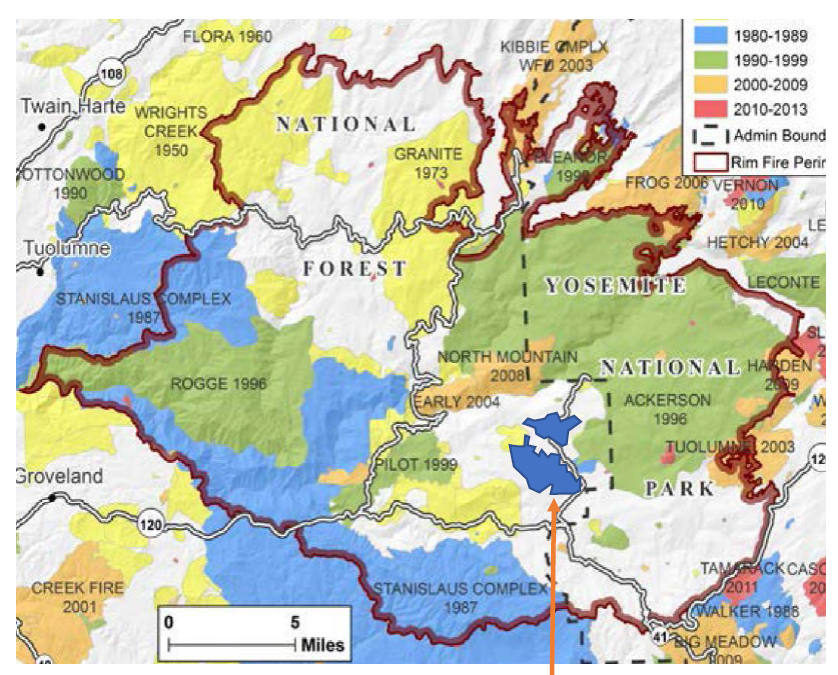

## Environment info

```{r}

knitr::opts_chunk$set(fig.width=12, fig.height=8, fig.align = "center")

# Load R packages
library(tidyverse)
library(curl)
library(sf)
library(spData) # Background maps

sf_use_s2(FALSE) # Turn off spherical geometry

```

## Fire data

Data were sourced from Cal Fire via this [web page](https://gis.data.ca.gov/maps/e3802d2abf8741a187e73a9db49d68fe/about).

First, a plot of the Rim Fire perimeter:

```{r}

fires <- st_read("./data/CA_fire_perimeters/California_Fire_Perimeters__all_.shp")

rim <- fires %>%
    filter(FIRE_NAME == "RIM", YEAR_ == 2013)

rim %>%
    ggplot() +
    geom_sf() +
    theme_bw()

```

## Overlap comparison

Next, let's find all the fires that came near the Rim Fire burn perimeter:

```{r}

rim_buffer <- st_buffer(rim, dist = 5e3) # Not sure about units, possibly meters

fires %>%
    filter(st_intersects(., rim_buffer, sparse = FALSE)[,1]) %>%
    filter(FIRE_NAME != "RIM", as.numeric(YEAR_) < 2013) %>% # I found no nearby fires in 2013
    arrange(as.numeric(YEAR_)) %>%
    ggplot(aes(fill = DECADES)) +
    geom_sf(color = "white") +
    geom_sf(data = rim, alpha = .3, fill = "black", color = "black") +
    scale_fill_manual(values = c(
        "yellow",
        "yellow",
        "yellow",
        "light blue",
        "light green",
        "orange",
        "red"
    )) +
    theme_bw()

```

There were quite a few. They generally seem to match the map from Tony, with the exception of a few older (yellow) fires:



The most noticeable omission is the Wrights (Wright's?) Creek fire of 1950. We could probably add perimeter data for this fire if necessary, but it was so long ago that I wonder about its relevance.
